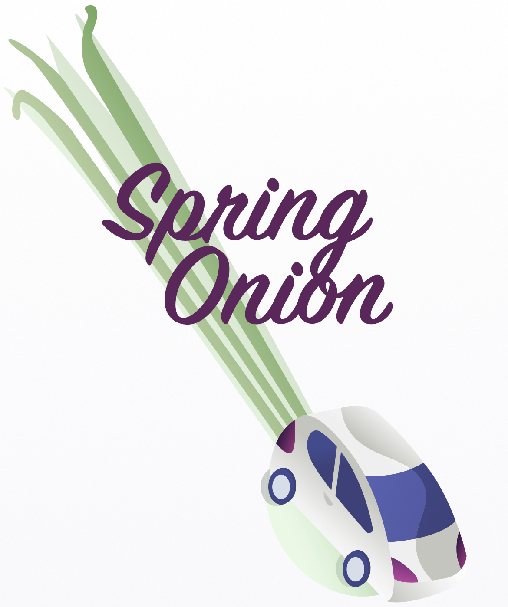

<p  align="center">
</img>
<br />
<br />


## About

Spring Onion is a mobile app on iOS and Android that allow users to be able to calculate the carbon footprint of car journeys.

All you need to know is your licence plate and the distance travelled and the app returns the amount of CO2 consumed, as well as other regular activities that consume a similar amount of CO2 for comparison. If you'd like to donate to offset your carbon emissions, you can follow a link to our chosen environmental organisation where a one-off payment can be made.

This project was built in the final two weeks at Makers Academy. We used React Native to create an E2E mobile app experience for the user. Our app is a one stop shop for environmentally conscious users that are looking to limit their contribution to global warming, no matter how small.

Check out our demo video (DEMO) to see how the app works in practice!

## Technologies used

Area | Technology
---- | ----
Framework | React Native, Expo
Language | Javascript, JSX
Emulators | Xcode, Android Studio

## Smells Like Green Spirit - The Development Team

[Glykeria Stravodimou](https://github.com/GlykeriaStr)  
[Jonathan Dawson](https://github.com/KarstenFinlay)  
[Karsten Finlay](https://github.com/bullhornfixie)  
[Miranda Wilson](https://github.com/mscwilson)  
[Tom Twigden](https://github.com/twigz826)

## How To Run

1) Clone this repository by entering `git clone https://github.com/GlykeriaStr/SmellsLikeGreenSpirit.git` in your terminal

2) Navigate to the root directory of the project

3) Enter `yarn install` in your terminal to install dependencies

4) Open a simulator for iOS using `yarn ios` (you must have Xcode installed), for Android open using the simulator of your choice.

5) Follow the prompts on the home screen

## Learning

Check out our learning log [here](https://github.com/GlykeriaStr/SmellsLikeGreenSpirit/blob/main/Documenting-Learning.md).

Check out our team charter [here](https://docs.google.com/document/d/15LuIkztoejXSH3xnyBak-b4HoZsaHOXN011JJEcq4zk/edit).

## User Stories
 ```
 As an environmentally conscious user
 So I can see my effect on the environment
 I want to be able to calculate my carbon emissions
 ```
 ```
 As an avid driver
 So that I can help the environment
 I want to see what I can do to benefit the environment
 ```
